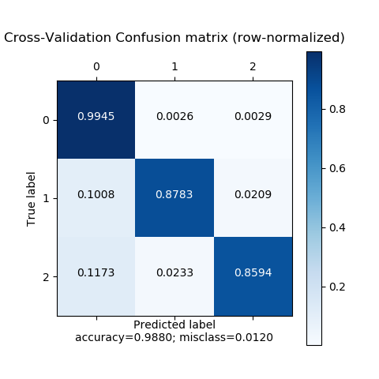
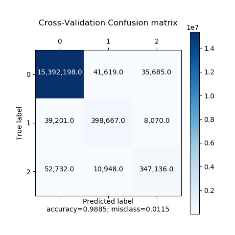
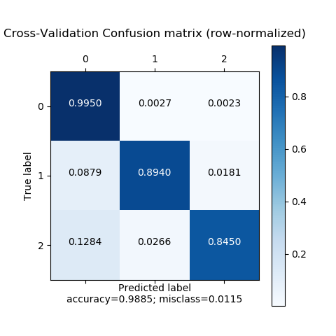
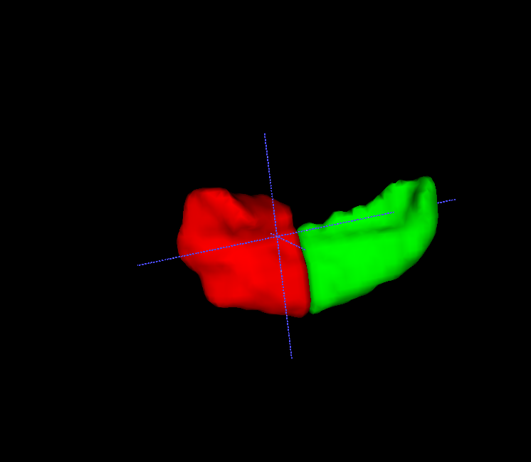
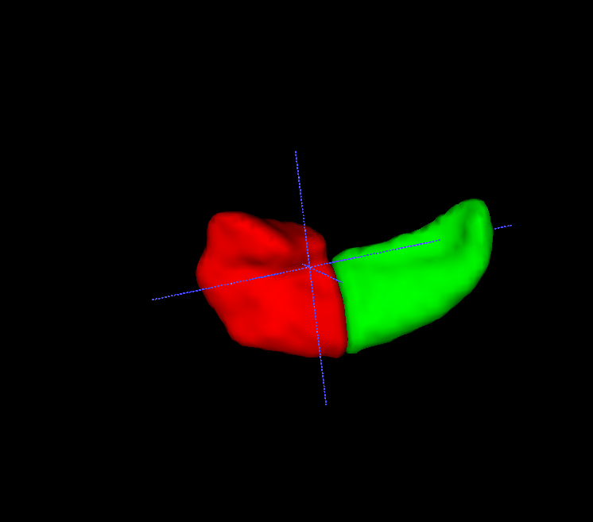
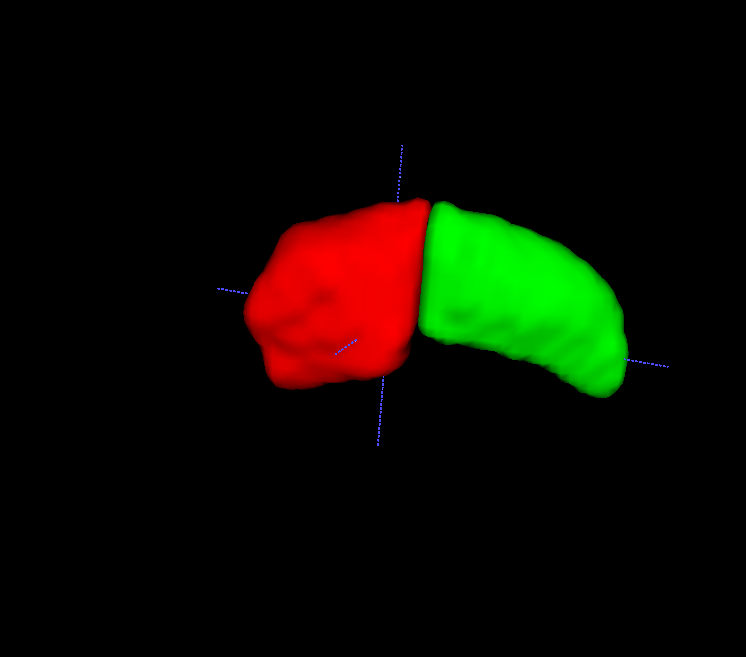
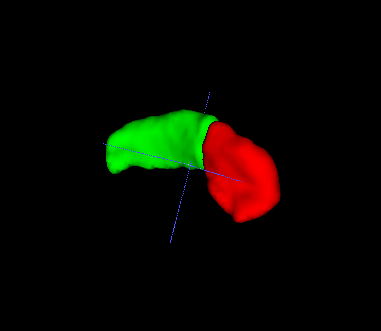
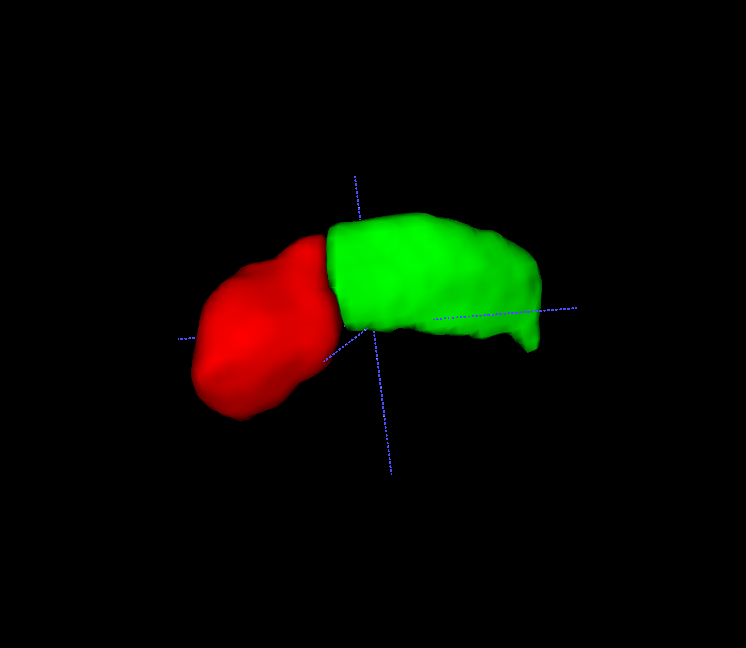

# Hippocampus Segmentation from MRI using V-Net
In this repo, hippocampus segmentation from MRI is performed 
using a Convolutional Neural Network (CNN) architecture based on
[V-Net](https://arxiv.org/abs/1606.04797).
The dataset is publicly available from the 
[Medical Segmentation Decathlon Challenge](http://medicaldecathlon.com/),
and can be downloaded from 
[here](https://drive.google.com/drive/folders/1HqEgzS8BV2c7xYNrZdEAnrHk7osJJ--2).

The [PyTorch](https://pytorch.org/) library has been used to write the model architecture 
and performing the training and validation. 
[SimpleITK](https://simpleitk.org/) has been exploited to handle I/O of medical images. 
3D Data Augmentation has been made by employing [torchio](https://arxiv.org/abs/2003.04696).

A 5-folders cross validation has been performed on the training set, yielding a 
Mean Multi Dice Coefficient of 0.8719 +/- 0.0387, a Dice Coefficient for 
Anterior Hippocampus of 0.8821 +/- 0.0367 and a Dice Coefficient for 
Posterior Hippocampus of 0.8617 +/- 0.0482.
The results are reported as "mean +/- std". 

Meshes and images reported in the ```images``` folder have been obtained exploiting 
[ITK-SNAP](http://www.itksnap.org/).

### Quality Measures
<table>
<tr>
<th colspan="4">Results</th>
</tr>
<tr>
<th> Model </th>
<th> Mean Dice per case </th>
<th> Dice per case (Anterior) </th>
<th> Dice per case (Posterior) </th>
</tr>
<tr>
<td>3D V-Net (no data augmentation)</td>
<td>0.8719 +/- 0.0387</td>
<td>0.8821 +/- 0.0367</td>
<td>0.8617 +/- 0.0482</td>
</tr>
<tr>
<td>3D V-Net (with data augmentation)</td>
<td> 0.8761 +/- 0.0374 </td>
<td> 0.8875 +/- 0.0354 </td>
<td> 0.8647 +/- 0.0455 </td>
</tr>
</table>

### Confusion Matrices
#### No Data Augmentation
<table>
<tr>
<th>Confusion Matrix </th>
<th>Normalized Confusion Matrix</th>
</tr>
<tr>
<th>

</th>
<th>

</th>
<tr>
</table>

#### With Data Augmentation
<table>
<tr>
<th>Confusion Matrix </th>
<th>Normalized Confusion Matrix</th>
</tr>
<tr>
<th>

</th>
<th>

</th>
<tr>
</table>


### TODO List
- [x] CNN Architecture Definition
- [x] 3D Data Loader for Nifti files
- [x] Definition of loss functions
- [x] Training loop
- [x] Cross-validation on Train set
- [x] Command Line Interface for training 
- [ ] Command Line Interface for validation 
- [ ] Data Augmentation 3D 
- [ ] Validation on Test set


## Training
Use ```python setup.py install``` for installing this package.
If you simply want to perform the training, run ```run/train.py```.
If you want to edit the configuration, modify the ```config/config.py``` file. In particular, consider the class ```SemSegMRIConfig```. 
If you want to play with data augmentation (built with ```torchio```), modify the ```config/augm.py``` file.

## Validation
If you want to perform the cross-validation, run ```run/validate.py``` or ```run/validate_torchio.py```. 
The former adopts a loop from scratch, whereas the latter exploits the DataLoader created upon ```torchio```. 

### Sample Images (Training set)
#### Ground Truth Images
<table>
<tr>
<th>Ground Truth - MRI 327 (1)</th>
<th>Ground Truth - MRI 327 (2)</th>
</tr>
<tr>
<td></td>
<td></td>
</tr>
</table>

#### Predicted Images
<table>
<tr>
<th>Prediction   - MRI 327 (1)</th>
<th>Prediction   - MRI 327 (2)</th>
</tr>
<tr>
<td></td>
<td></td>
</tr>
</table>

### Sample Images (Test set)
#### Predicted Images
<table>
<tr>
<th>Prediction   - MRI 283 (1)</th>
<th>Prediction   - MRI 283 (2)</th>
</tr>
<tr>
<td></td>
<td></td>
</tr>
</table>